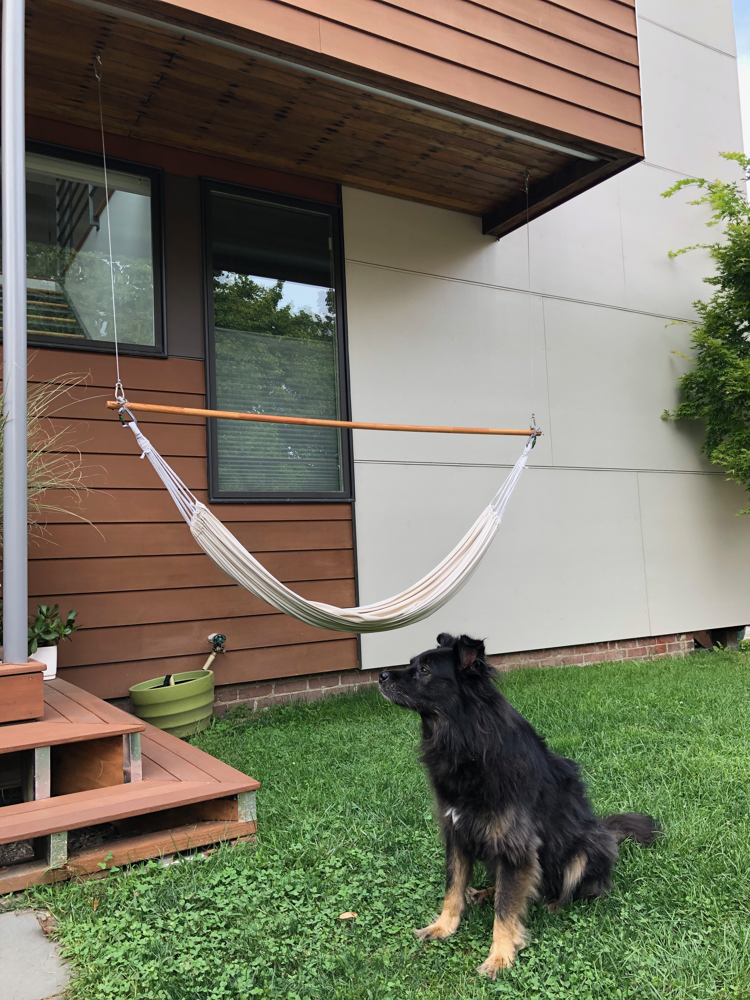
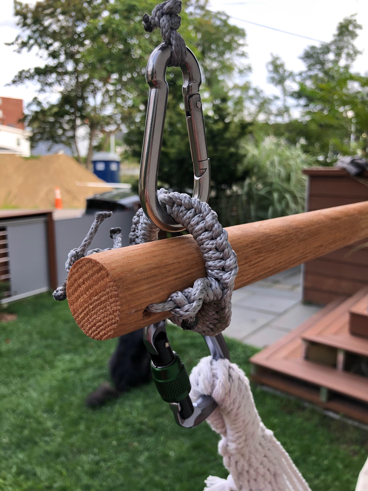

# hammock

- Use the notebook to compute the suspension loads.
- Adjust occupant weight and ridgepole diameter, length, and modulus.
- Rigging between the ridgepole and the rest of the suspension transfers no appreciable moment (simply supported).
- Longer ridgepoles allow for shallower hammock suspension angles (30º is ideal). 
- Shallower hammock suspension angles increase the buckling stress in ridgepole.
- Pre-drill holes for eye screws (15/65" for 3/8" screw).
- Anchor hitches everywhere.
- Ringbolt hitching around suspension joint rings optional but helps cord used to transfer center lateral load along neutral axis of ridgepole.
  
| Quantity | Item |
| --- | --- |
| 1 | 8 foot long ⨉ 1-5/16" diameter oak closet rod (sub-optimal but accessible) |
| 2 | 3/8" thick ⨉ 4" long eye lag screws |
| 2 | 3/8" thick ⨉ 3" diameter rings |
| 1 | ~25 ft Amsteel 7/64" rope |
| 6 | caribiners (optional) |
  
  
  